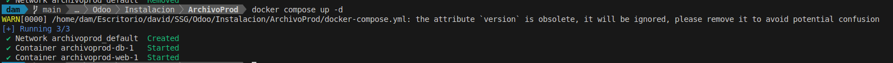
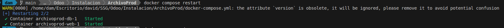

# Instalacion de contenedores de docker 


### 1. Descargar los archivos proporcionados y almacenarlos.

```bash
.
├── Archivo1
│   ├── docker-compose.yml
│   ├── prod
│   │   └── addons
│   └── volumesOdoo
│       ├── addons
│       └── odoo
│           ├── filestore
│           └── sessions
├── Archivo2
│   ├── dev
│   │   └── addons
│   └── docker-compose.yml
```

### 2. Despues ejecutas en cada una de las carpetas el comando para iniciar y crear el contenedor.

```bash
docker compose up -d
```





### 3. Entras al puerto de cada uno de los contenedores en este caso 8070 y 8069.


#### Puerto 8069


#### Puerto 8070


